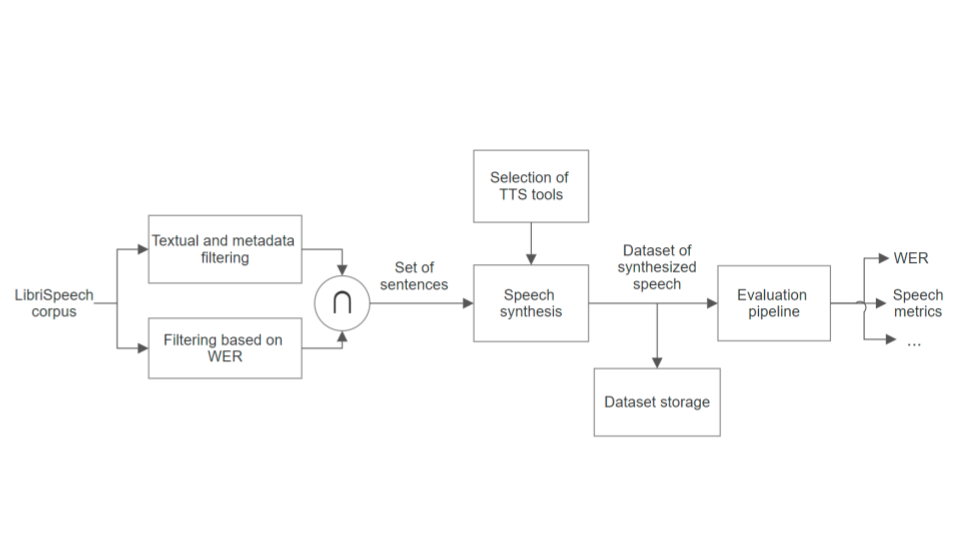

# Synthetised Speech Dataset

#### Creation and evaluation of a dataset of synthetic speech tracks

## Introduction
This didactic Project was built in the frame of the Master program "Music and Acoustic Engineering" at Politecnico di Milano. 
The goal of this project is to generate a dataset of synthetic speech that could be further used in the field of fake speech detection and similar.

## Content description

In this repository you can find the Python code to use the Text-To-Speech tools/APIs selected for the dataset generation, as well as 3 colab notebooks:
- Dataset Creation - Main.ipynb contains all the pre-processing steps from LibriSpeech dataset to pick the textual sentences that would compose the dataset to be generated
- Dataset Evaluation - Main.ipynb contains a pipeline of evaluation metrics meant to characterise the different TTS tools used to generate the dataset
- Recurrent error and PER.ipynb contains a deeper more detailed study of the generated dataset through phonetics evaluation and words performances comparison

## Published paper and dataset

The paper written as a result of this project can be found at the following link:  
https://drive.google.com/file/d/1AljpqY1ah7Wz7q0pJ4qduU_f-WjG1ClW/view?usp=sharing

The generated dataset of synthesised speech is available at this link:  
https://drive.google.com/file/d/1FVEcYTVtJYX-_e7GBgYmj15DRmnszyVS/view?usp=sharing

## More detailed pipeline

In the diagram above you can have a more detailed overview of the pipeline of the project. 
- The first blocks on the left, corresponding to the generation of the "set of sentences", can be find in the first notebook (Dataset Creation).
- The "Speech synthesis" block was achieved using the code you can find in the "speech_synthesis_src" folder.
- The evaluation pipeline then corresponds to the two other Python notebooks of the project.

## Authors
Andriana Takić  
Cecilia Marson  
Clément Jameau  
